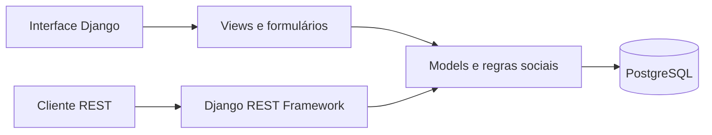

# Pulse — Rede social com Django

Rede social full stack inspirada em plataformas de microblog. O Pulse reúne autenticação, perfis, relacionamentos, feed personalizado, publicações e interações em uma aplicação responsiva com API REST.

**Aplicação online:** https://pulse-social-network-django.onrender.com  
**Conta de demonstração:** `demo` / `pulse-demo-2026`

[](https://github.com/Gustavo-tec0110/pulse-social-network-django/actions/workflows/ci.yml)

## Destaques

- cadastro, login, alteração de senha e edição independente do perfil;
- foto, biografia, localização e site pessoal;
- sistema de seguidores com proteção contra relações duplicadas;
- feed cronológico formado apenas pelo próprio usuário e por pessoas seguidas;
- publicações de até 280 caracteres com imagem opcional;
- curtidas e comentários protegidos por autenticação;
- busca de pessoas e publicações;
- API REST para usuários, feed, posts, seguidores, curtidas e comentários;
- PostgreSQL, Docker, testes automatizados e GitHub Actions;
- interface responsiva e acessível, construída sem framework visual pronto.

## Arquitetura



## Modelo social

- `Profile`: informações públicas vinculadas ao usuário;
- `Follow`: relação única entre seguidor e pessoa seguida;
- `Post`: texto, imagem e autoria;
- `Like`: uma curtida por usuário e publicação;
- `Comment`: comentários associados a usuário e publicação.

## Executar localmente

```bash
poetry install
poetry run python manage.py migrate
poetry run python manage.py seed_demo
poetry run python manage.py runserver
```

Abra `http://127.0.0.1:8000`. O comando opcional `seed_demo` cria contas locais de demonstração; a senha é `pulse-demo-2026`.

## Executar com Docker

```bash
docker compose up --build
```

## Testes e qualidade

```bash
poetry run python manage.py check
poetry run python manage.py makemigrations --check --dry-run
poetry run python manage.py test
poetry run python manage.py collectstatic --noinput
```

O workflow em `.github/workflows/ci.yml` repete essas validações com PostgreSQL a cada push e pull request.

## API REST

| Método | Endpoint | Função |
|---|---|---|
| `POST` | `/api/register/` | criar conta |
| `POST` | `/api/token/` | obter token |
| `GET` | `/api/users/` | listar usuários |
| `POST` | `/api/users/{username}/follow/` | seguir ou deixar de seguir |
| `GET/POST` | `/api/posts/` | listar ou criar publicações |
| `GET` | `/api/posts/feed/` | consultar o feed personalizado |
| `POST` | `/api/posts/{id}/like/` | curtir ou remover curtida |
| `GET/POST` | `/api/posts/{id}/comments/` | listar ou criar comentários |

Para endpoints protegidos, envie `Authorization: Token <token>`.

## Produção

O projeto aceita `DATABASE_URL`, serve arquivos estáticos com WhiteNoise e usa Gunicorn. As variáveis necessárias estão em `.env.example`; o `Procfile` executa migrações antes de iniciar o serviço.

## Licença

Distribuído sob a licença MIT.
